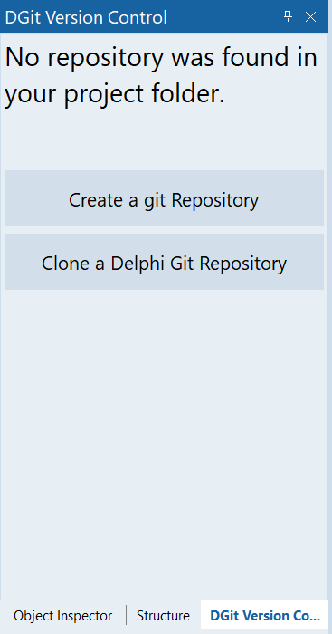
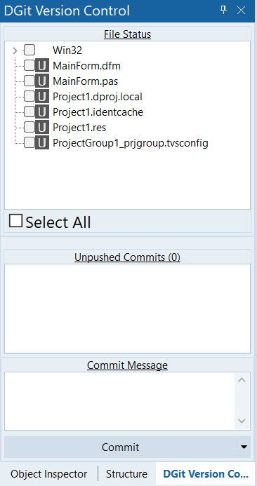
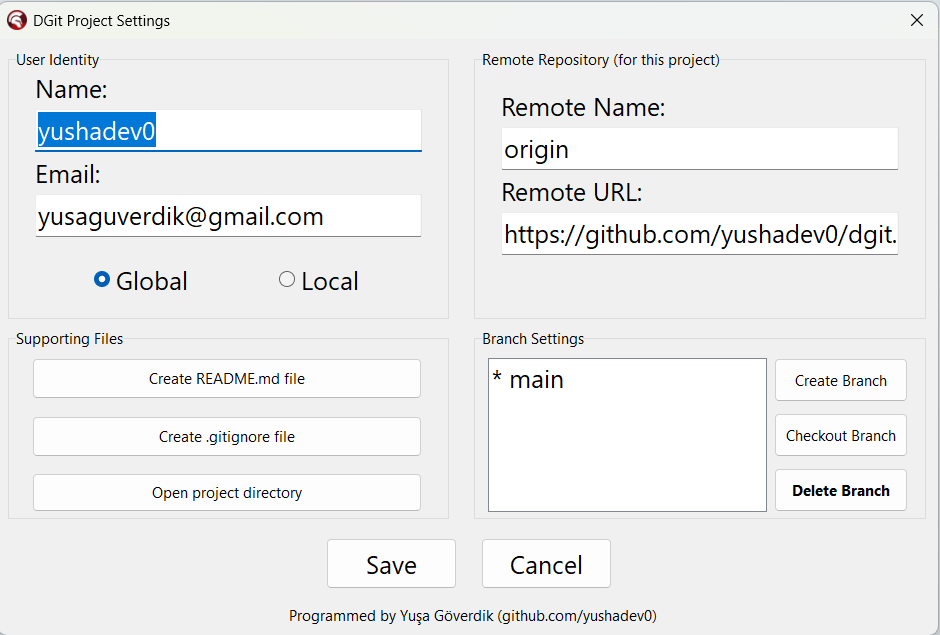

# DGit - Native Git Integration for Delphi IDE

DGit is a fully native, dockable Git plugin for the Delphi IDE that brings modern Git workflows directly into your development environment. Manage repositories, commits, branches, and Git configuration without leaving the IDE.

---

## Screenshot





---

## Features

### Smart Change Detection

- Automatically monitors project files.
- Detects changes in the background.
- No IDE freezing or UI flickering.

### Fast Staging

- VS Code-inspired TreeView
- Folder-based staging
- Select All / Unselect All
- Automatic refresh

### Commit & Push

- Split-button Commit
- Commit & Push
- Automatic branch name configuration for new repositories

### Branch Management

- Create branches
- Checkout branches
- Delete inactive branches safely
- Active branch protection

### Git Configuration

- Global user name/email
- Local user name/email
- Origin URL configuration

### Project Helper Files

- Generate `.gitignore`
- Generate `README.md`

---

## Installation

1. Clone the repository.

```bash
git clone https://github.com/yushadev0/dgit.git
```
2. Open dgit.droj in Delphi.
3. Build dgit.bpl.
4. Install the package.
5. Open DGit -> Open DGit Panel.

## Usage
1. Open your Delphi project.
2. Open the DGit panel (you can dock it anywhere you want).
3. If the project is not a Git repository, click Initialize Repository.
4. Stage your changes.
5. Enter a commit message.
6. Click Commit or Commit & Push.
---
## Roadmap
- Pull
- Visual Diff
- Git History
- Conflict Resolution
- Much beautiful track icons
---
## Contributing
Pull requests, bug reports, and feature suggestions are welcome.

---

## Licence
This project uses MIT License

--- 

Developed by Yuşa Göverdik for Delphi Community.